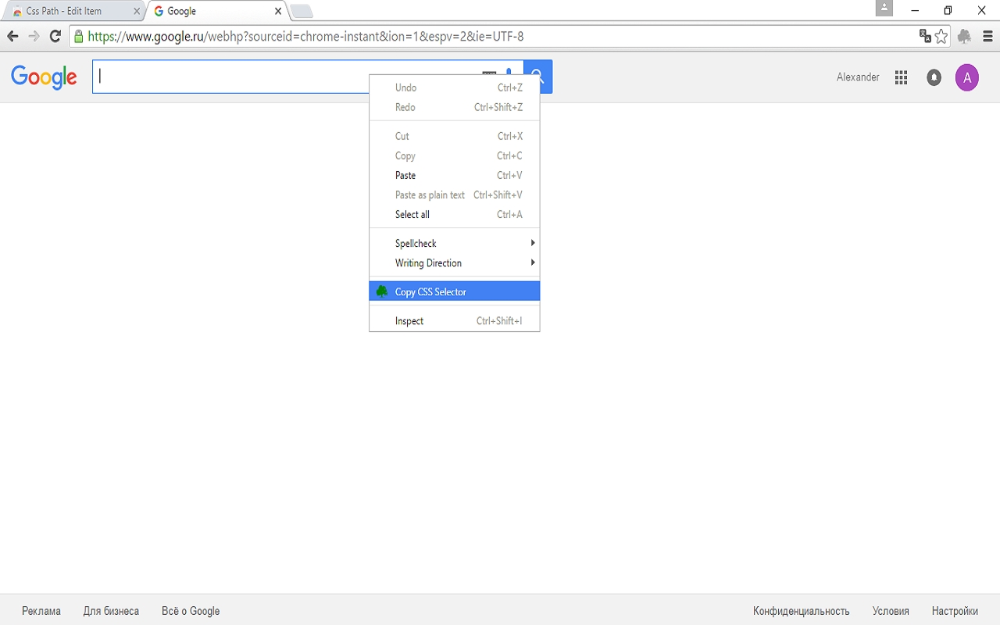
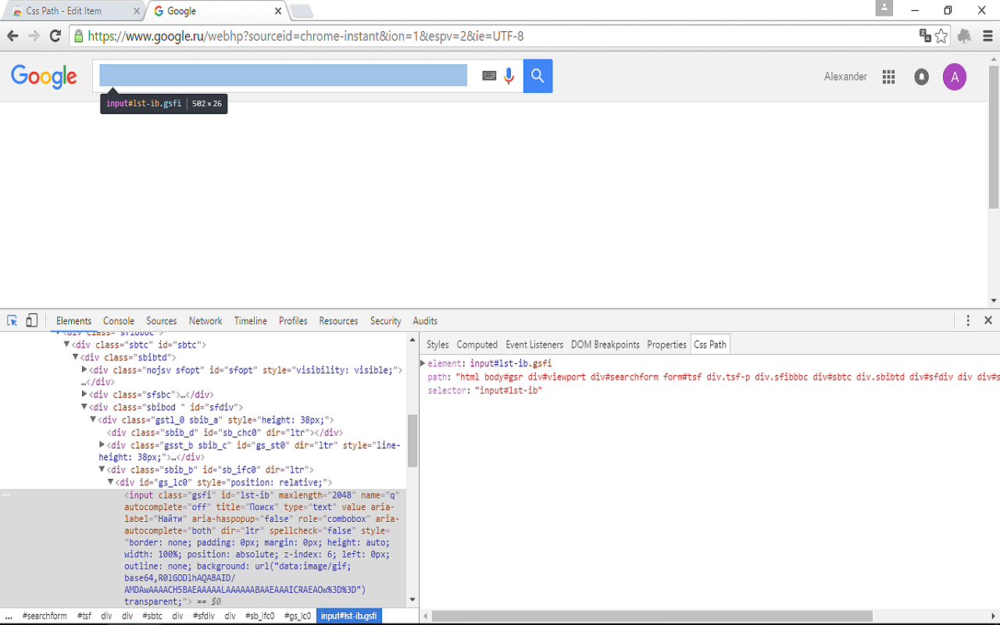

# CopyCssSelector

Extension helps get selectors from elements

## Tests

You can view the results of the Copy Css Selector test suite [in your browser!](https://rawgit.com/flamencist/cssPath/master/spec-runner.html)

